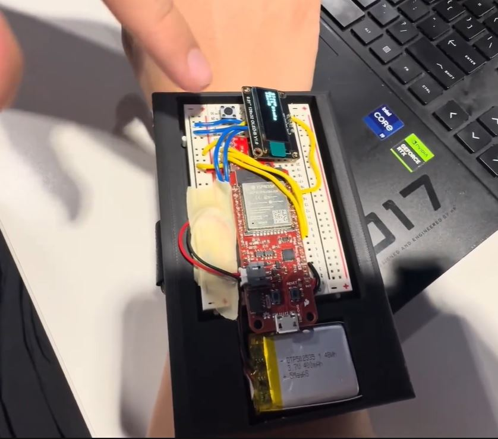
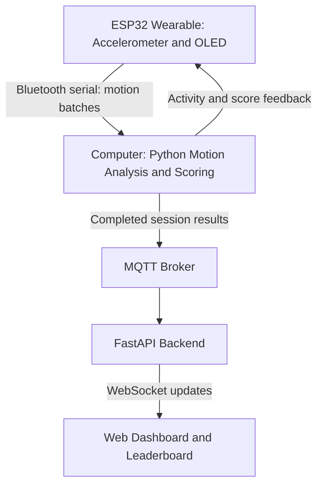
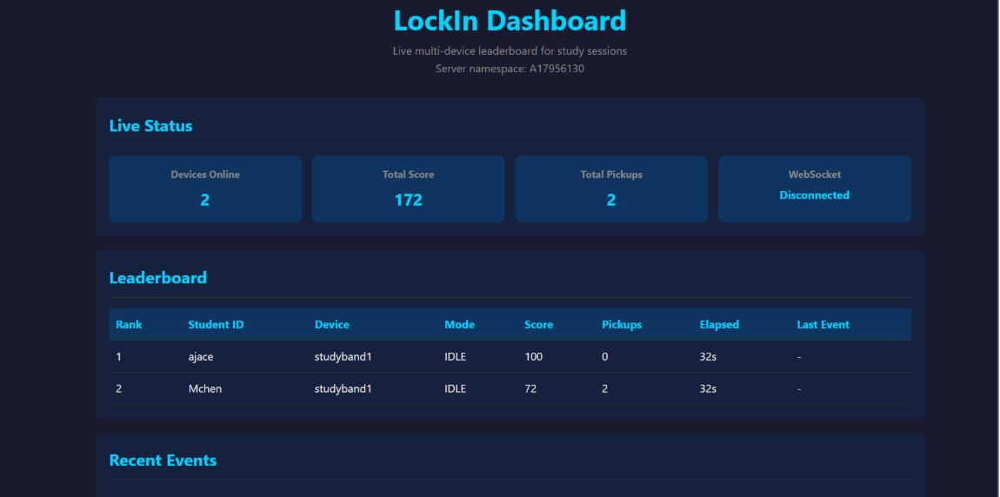

# StudyBand — Wearable Study Tracker

A wrist-worn study tracker that uses accelerometer data to identify study-related movement and phone-pickup motions, provide feedback, and encourage focus through friendly competition on a shared leaderboard.

Developed with **Mingyang Chen** for **UC San Diego ECE 16**, this project combines an **ESP32 wearable, Python motion processing, MQTT messaging, and a FastAPI web dashboard**. The course prototype was also called **LockIn**.

My work focused on the **backend, MQTT communication, dashboard and leaderboard, CAD enclosure, and collaborative system integration**.

*StudyBand wearable prototype, combining an ESP32, accelerometer, OLED display, and button in a wrist-mounted enclosure.*

[Watch the Product Demo](https://youtu.be/1E151O02fLM)

---

## Project Overview

StudyBand was designed to help students recognize phone-related distractions and make focused study sessions more engaging. The wearable captures wrist movement, while a connected computer analyzes the data and calculates a session score. Participants can compare their results on a shared leaderboard.

The project explored how sensor data, a wearable enclosure, and a connected dashboard could work together as a complete study-support prototype.

## My Contributions

- Ported the **ESP32 firmware** from Arduino IDE assignments to a **PlatformIO project in VS Code**.
- Implemented **accelerometer data logging** to collect labeled recordings of phone pickup, typing, writing, stillness, and random arm movement.
- Analyzed **motion magnitude and changes in calculated pitch and roll** to distinguish phone-pickup motions from study-related activity.
- Tuned **motion-detection thresholds** using the collected data to improve activity classification.
- Collaborated on **system integration and testing** across the wearable, Python processing pipeline, MQTT messaging, and web dashboard.

## System Architecture

The ESP32 collects accelerometer samples at a target rate of **100 Hz** and sends them in **300-sample batches**. Motion classification and scoring run on the connected computer. Feedback returns to the wearable's OLED, and completed session results are published through MQTT to the dashboard.

## Motion Detection and Scoring

We collected **70 labeled motion recordings** covering phone pickup, stillness, typing, writing, and random arm movement. These recordings supported motion analysis and threshold tuning.

The processing pipeline uses accelerometer magnitude and changes in calculated pitch and roll to classify each batch. The running classifier produces three states:

| Detected State | Interpretation | Score Change |
|---|---|---|
| `active_study` | Wrist movement classified as active study | +1 per classified batch |
| `still` | Limited wrist movement | No change |
| `phone_pickup` | Motion matching the phone-pickup thresholds | −15 when outside the penalty cooldown |

Each session starts at **100 points**, with the score limited to **0–100**. An **8-second cooldown** limits repeated phone-pickup penalties. Writing and typing are separate labels in the collected data but are grouped under active study during operation.

## Motion Analysis and Threshold Calculations

StudyBand uses accelerometer readings and experimentally tuned thresholds to classify wrist movement as **phone pickup**, **active study**, or **still**. The ESP32 samples at a target rate of **100 Hz**, sending **300-sample batches** to Python for analysis.

### Signal Processing

The three accelerometer readings are combined using the **L1 norm**:

$$
L_1 = |a_x| + |a_y| + |a_z|
$$

A **10-sample moving average** smooths this signal to reduce short-term fluctuations. The largest smoothed value within an analysis window becomes `l1_peak`.

The code also calculates orientation-related features:

$$
\text{pitch} = \operatorname{atan2}\left(a_x,\sqrt{a_y^2+a_z^2}\right)
$$

$$
\text{roll} = \operatorname{atan2}\left(a_y,\sqrt{a_x^2+a_z^2}\right)
$$

Their variation within a window is measured as:

$$
P = \text{pitch}_{\max} - \text{pitch}_{\min}
$$

$$
R = \text{roll}_{\max} - \text{roll}_{\min}
$$

The combined variation is `tilt_sum`, calculated as **P + R**. These angle features are expressed in radians. Because they use raw ADC readings without offset calibration, they serve as classification features rather than precise wrist-angle measurements.

### Selecting the Analysis Window

To capture brief gestures, the code searches each batch using overlapping **50-sample windows**, approximately **0.5 seconds** each, advancing by five samples at a time.

Each window receives a selection score:

$$
S = 2P + 2R + 0.0002L_{1,\text{peak}}
$$

The highest-scoring window is used for classification. This score favors windows with greater angle variation and larger signal values; it is separate from the participant’s study-session score.

### Activity Classification

The classifier applies the following rules in order:

| State | Decision Rule |
|---|---|
| **Phone pickup** | `l1_peak > 4700`, `P + R > 0.24`, `P > 0.10`, and `R > 0.10` must all be true |
| **Active study** | Phone-pickup conditions fail, but `P + R > 0.10` |
| **Still** | `P + R ≤ 0.10` |

For example, a window with `l1_peak = 4900`, `P = 0.15`, and `R = 0.12` is classified as a phone pickup because all four conditions are satisfied.

Thresholds were tuned using labeled recordings of phone pickup, typing, writing, stillness, and random arm movement. Writing and typing are grouped under **active study** during operation. Since classification relies on wrist-motion patterns, unrelated movements may produce similar results.

## Dashboard and Friendly Competition

The dashboard brings results from multiple participants and devices into one leaderboard. It displays each participant's score, detected phone-pickup count, session duration, and latest event.

Participants are ranked by **highest score**, with **fewer phone pickups** used to break score ties. Results are sent at the end of each session, allowing friends to compare their study sessions.

*StudyBand dashboard showing participant rankings, session scores, phone-pickup counts, and recent session events.*

## Hardware and Enclosure

| Component | Role |
|---|---|
| ESP32 development board | Collects sensor data and communicates with the computer |
| Three-axis accelerometer | Measures wrist motion |
| OLED display | Presents activity and score feedback |
| Push button | Provides a physical input for the prototype |
| Custom CAD enclosure | Packages the electronics for wrist-mounted use |

I designed the enclosure to bring the sensing, display, and control components together in a wearable form.

## Testing and Limitations

Development included collecting labeled motion data, analyzing movement features, tuning detection thresholds, and integrating the wearable with the dashboard.

- Detection uses **motion thresholds** and may be affected by wrist placement and differences between users.
- A detected phone-pickup motion is an estimate; the device does not directly measure attention or ongoing phone usage.
- The prototype requires a **connected computer** for classification, scoring, and MQTT publishing.
- The current dashboard maintains results in memory rather than a persistent session-history database.

## Technologies

**ESP32 · Arduino/C++ · PlatformIO · Python · NumPy · SciPy · Bluetooth Serial · MQTT · FastAPI · WebSockets · HTML/CSS/JavaScript · CAD**

## Team and Acknowledgments

**Aden Tan:** ESP32 firmware port to the VS Code development environment, accelerometer data logging, motion analysis, and detection-threshold tuning.

**Mingyang Chen:** FastAPI backend, MQTT communication, web dashboard and leaderboard, and CAD enclosure design.

Both team members collaborated on system integration and testing. The project builds on UC San Diego ECE 16 coursework and supporting course libraries.
